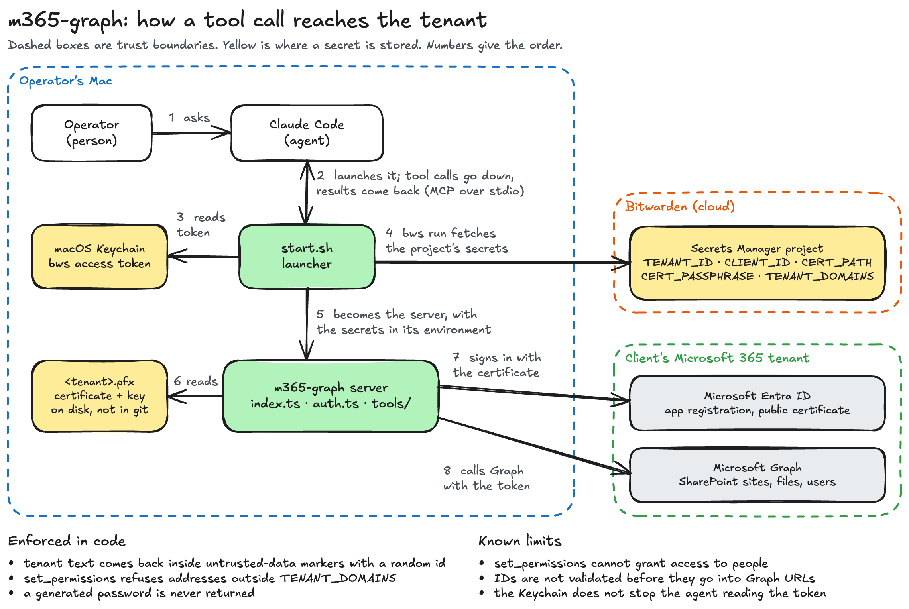

# sample-agent-skills

A working sample of AI automation tooling for Claude Code: an MCP server for Microsoft 365, a script that manages per-client local databases, a skill that audits other skills, and the security policy that ties them together.

It is a curated subset of a private repository used for client work at TruNXT. Client material and third-party skills were left out. What remains is working code, documented with its limits.

## What is here

| Path | What it is |
|---|---|
| [`mcp-servers/m365-graph/`](mcp-servers/m365-graph/) | TypeScript MCP server: 11 tools for SharePoint sites, libraries, files and users over Microsoft Graph, with certificate authentication. Two skills ship with it. |
| [`infrastructure/docker/`](infrastructure/docker/) | `dev`, a bash script that gives each client isolated Postgres and Redis containers for local development |
| [`skills/auditing-skills/`](skills/auditing-skills/) | A Claude Code skill that audits a skills repo for structural defects |
| [`docs/security/`](docs/security/) | Secrets policy, content-handling rule and three runbooks |
| [`.claude/`](.claude/) | Rules and a hook that apply when Claude Code edits this repo |
| [`tests/`](tests/) | Deliberately broken skills used to check the auditor |

## M365 server

The server signs in to a tenant as an application, using a certificate. Credentials are read from Bitwarden Secrets Manager when the server starts and are never written to Claude Code's configuration.



Diagram source: [`docs/architecture.excalidraw`](docs/architecture.excalidraw).

```bash
cd mcp-servers/m365-graph
npm install
npm test                    # 25 tests
npx tsc --noEmit -p .       # type check
```

- Connect it to a tenant: [`m365-graph-setup/SKILL.md`](mcp-servers/m365-graph/m365-graph-setup/SKILL.md)
- Tools, required permissions and limits: [`m365-graph-operations/SKILL.md`](mcp-servers/m365-graph/m365-graph-operations/SKILL.md)

Three protections are in the code, not only in instructions to the model:

- Text returned from the tenant is wrapped in markers carrying a random id, so content cannot pose as the end of the data.
- `set_permissions` refuses addresses outside the tenant's own domains unless the call says otherwise.
- `reset_password` never returns a password it generated.

## Local databases

```bash
alias dev="$PWD/infrastructure/docker/scripts/dev"
dev new acme-corp     # Docker config + ~/clients/acme-corp/ workspace
dev up acme-corp      # start Postgres and Redis, print connection strings
dev status
```

Commands, generated files, port scheme and limitations: [`infrastructure/docker/README.md`](infrastructure/docker/README.md).

## Skills

A skill is a folder with a `SKILL.md`: YAML frontmatter (`name`, `description`) followed by instructions. Claude reads the description to decide when to load it. To use one, symlink its folder into `~/.claude/skills/` or a project's `.claude/skills/`.

| Skill | Does |
|---|---|
| `skills/auditing-skills` | Checks name and folder match, frontmatter, stale references, broken links and body length across a skills repo |
| `infrastructure/docker` (name `docker`) | Drives the `dev` script |
| `mcp-servers/m365-graph/m365-graph-setup` | Connects the server to a tenant |
| `mcp-servers/m365-graph/m365-graph-operations` | Uses the M365 tools safely |

Format rules: [`.claude/rules/skill-format.md`](.claude/rules/skill-format.md).

## Security model

- **Secrets** live in Bitwarden Secrets Manager and reach a process only through `bws run`, with the access token held in the macOS Keychain. [`docs/security/secrets-management.md`](docs/security/secrets-management.md) says what that does and does not protect.
- **Retrieved content is data, never instructions.** [`docs/security/content-handling.md`](docs/security/content-handling.md) states the rule and how the server and a hook apply it.
- **Runbooks** cover setup, migration and emergency rotation: [`docs/security/runbooks/`](docs/security/runbooks/).

## Known limitations

Stated plainly, because a sample that hides them teaches the wrong thing.

- `set_permissions` cannot grant access to people. The Graph call it uses accepts application identities only.
- The server does not validate IDs before putting them into Graph URLs. Pass only IDs that came from a tool result.
- Limits on destructive tools are partly instructions to the model: `allowExternal` is a flag the model sets, and `upload_file` overwrites.
- `dev` assigns ports by counting folders and publishes them on all interfaces. It is for a trusted development machine.
- There is no CI. Tests and the secret scan run when someone runs them.
- macOS is assumed for the Keychain steps.

## Notes

- Examples in the docs assume the repo is cloned to `~/projects/agent-skills`. Adjust paths if yours differs.
- Client workspaces are separate git repositories at `~/clients/<client>/`. None are included.
